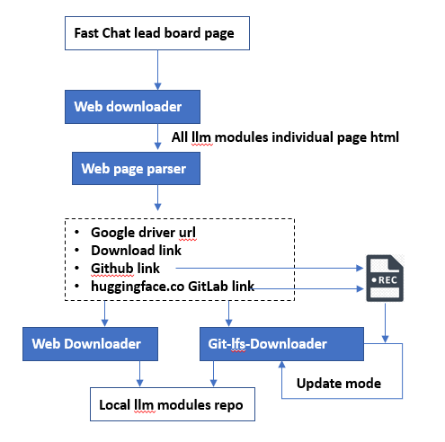

# Get Repo Downloader

This module is used to batch git clone the large file system 

### Program workflow



needed lib:

git-lfs: https://askubuntu.com/questions/799341/how-to-install-git-lfs-on-ubuntu-16-04

GitPython : https://gitpython.readthedocs.io/en/stable/tutorial.html

Run under back ground:

```
sudo nohup python3 gitDownloader.py &
```

Check the process or stop:

```
sudo ps ax | grep python3
```

Check folder size:

```
du -sh /mnt/storage/llmModules/Vicuna-7B/
```


### Download State

| Model                                                        | Download link available | Download state | License           |
| ------------------------------------------------------------ | ----------------------- | -------------- | ----------------- |
| [GPT-4](https://openai.com/research/gpt-4)                   | **No**                  | No             | Proprietary       |
| [Claude-1](https://www.anthropic.com/index/introducing-claude) | **No**                  | No             | Proprietary       |
| [Claude-2](https://www.anthropic.com/index/claude-2)         | **No**                  | No             | Proprietary       |
| [Claude-instant-1](https://www.anthropic.com/index/introducing-claude) | **No**                  | No             | Proprietary       |
| [GPT-3.5-turbo](https://openai.com/blog/chatgpt)             | **Yes**                 | No             | Proprietary       |
| [Vicuna-33B](https://huggingface.co/lmsys/vicuna-33b-v1.3)   | **Yes**                 | Yes            | Non-commercial    |
| [Llama-2-70b-chat](https://huggingface.co/meta-llama/Llama-2-70b-chat-hf) | **Yes**                 | Yes            | Llama 2 Community |
| [WizardLM-13b-v1.2](https://huggingface.co/WizardLM/WizardLM-13B-V1.2) | **Yes**                 | Yes            | Llama 2 Community |
| [Vicuna-13B](https://huggingface.co/lmsys/vicuna-13b-v1.5)   | **Yes**                 | Yes            | Llama 2 Community |
| [MPT-30B-chat](https://huggingface.co/mosaicml/mpt-30b-chat) | **Yes**                 | Yes            | CC-BY-NC-SA-4.0   |
| [Guanaco-33B](https://huggingface.co/timdettmers/guanaco-33b-merged) | **Yes**                 | Yes            | Non-commercial    |
| [CodeLlama-34B-instruct](https://huggingface.co/codellama/CodeLlama-34b-Instruct-hf) | **No**                  | Yes            | Llama 2 Community |
| [PaLM-Chat-Bison-001](https://cloud.google.com/vertex-ai/docs/generative-ai/learn/models) | **Yes**                 | No             | Proprietary       |
| [Vicuna-7B](https://huggingface.co/lmsys/vicuna-7b-v1.5)     | **Yes**                 | Yes            | Llama 2 Community |
| [Llama-2-13b-chat](https://huggingface.co/meta-llama/Llama-2-13b-chat-hf) | **Yes**                 | Yes            | Llama 2 Community |
| [Llama-2-7b-chat](https://huggingface.co/meta-llama/Llama-2-7b-chat-hf) | **Yes**                 | Yes            | Llama 2 Community |
| [Koala-13B](https://bair.berkeley.edu/blog/2023/04/03/koala/) | **No**                  | No             | Non-commercial    |
| [ChatGLM2-6B](https://huggingface.co/THUDM/chatglm2-6b)      | **Yes**                 | No             | Apache-2.0        |
| [GPT4All-13B-Snoozy](https://huggingface.co/nomic-ai/gpt4all-13b-snoozy) | **Yes**                 | Yes            | Non-commercial    |


Log: 

```
[sudo] password for ncl:
Start to clone the repo: Vicuna-7B
Finished
Start to clone the repo: Vicuna-33B
Finished
Start to clone the repo: Llama-2-70b-chat
error: Cmd('git') failed due to: exit code(128)
  cmdline: git clone -v -- https://huggingface.co/meta-llama/Llama-2-70b-chat-hf Llama-2-70b-chat
  stderr: 'Cloning into 'Llama-2-70b-chat'...
'
Start to clone the repo: WizardLM-13b-v1.2
Finished
Start to clone the repo: Vicuna-13B
Finished
Start to clone the repo: MPT-30B-chat
Finished
Start to clone the repo: Guanaco-33B
Finished
Start to clone the repo: CodeLlama-34B-instruct
Finished
Start to clone the repo: Llama-2-13b-chat
error: Cmd('git') failed due to: exit code(128)
  cmdline: git clone -v -- https://huggingface.co/meta-llama/Llama-2-13b-chat-hf Llama-2-13b-chat
  stderr: 'Cloning into 'Llama-2-13b-chat'...
fatal: could not read Username for 'https://huggingface.co': No such device or address
'
Start to clone the repo: Llama-2-7b-chat
error: Cmd('git') failed due to: exit code(128)
  cmdline: git clone -v -- https://huggingface.co/meta-llama/Llama-2-7b-chat-hf Llama-2-7b-chat
  stderr: 'Cloning into 'Llama-2-7b-chat'...
fatal: could not read Username for 'https://huggingface.co': No such device or address
'
Start to clone the repo: GPT4All-13B-Snoozy
Finished

```

